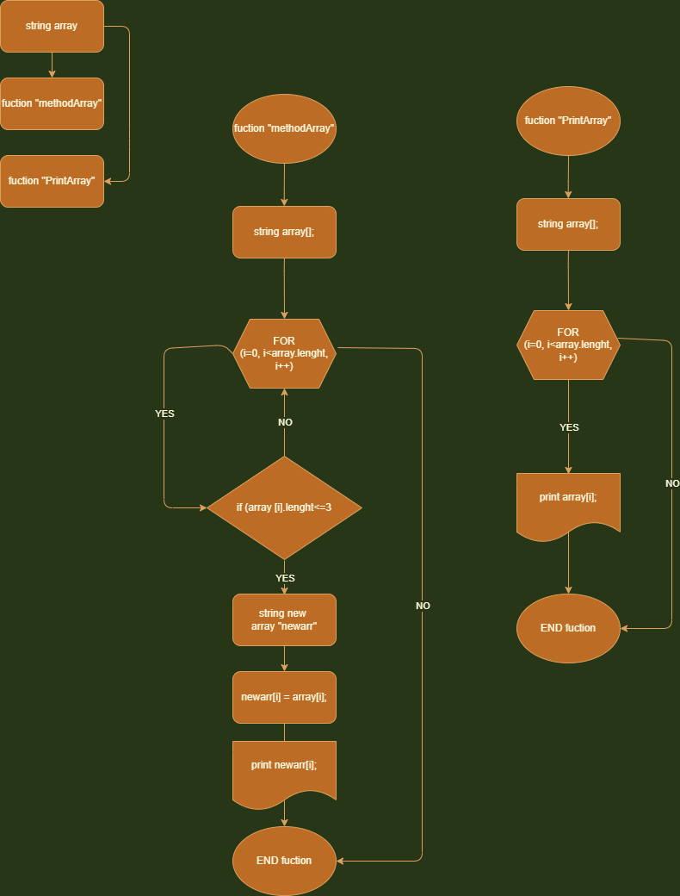

## Контрольная работа.

**Задача**: Написать программу, которая из имеющегося массива сторк формирует массив из строк, длинна которых меньше либо равна 3 символа. Первоначальный массив можно ввести с клавиатуры, либо задать на страте выполнения алгоритма. При решении не рекомендуется пользоваться коллекциями, лучше обойтись массивами.

__Примеры__: 

> ["hello " , "2" , "world" , " )" ] > ["2" , ")"]

> ["123" , "4567" ," )" ] > [")"]

> ["Rus " , "Kaz" , "world"] > [] .

## Решение задачи:

*Сначала создаем строковый массив, решать будем методом, который будет выполнять требуемые операции и условия.
Пишем цикл в котором будут перебираться элементы массива. В тело цикла добавляем условия выборки из условия задачи, если есть элемент удовлетворяющий условиям, тогда иннициализируется новый массив такого же типа и в ячейку нового массива записывается значение ячейки первичного массива*

## Блок-схема алгоритма  
